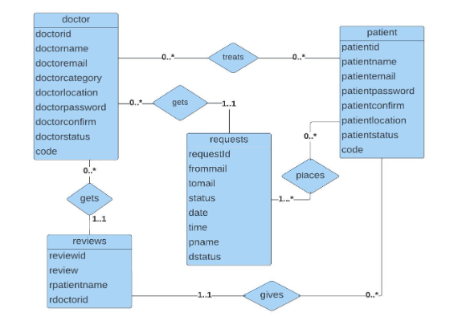

## Course Title: Database Management Systems Lab
## Course Code: CSE4410
## Project Title: Find-A-Doc

## Team Members:
1. Shaira Sadia Karim, ID: 200042122
2. Lamia Alam, ID: 200042162
3. Maliha Zaman, ID: 200042114
## Overview:
Find-A-Doc is a PHP-based website designed to schedule patient appointments with doctors, eliminating the need for patients to call doctors' offices for appointment scheduling.

## Key Features:
1. User Registration: Patients and doctors can register by providing their name, email, contact number, location, password. Later, the authentication process will be carried out by a verification link sent via email.
   
2. Booking: Patients can book an appointment by providing doctor's email, date, time and see the status of their appointments. Appointments are booked without overlapping time slots or conflicting schedules. Patients can reschedule too if their appointment gets cancelled.

3. Search and Filter:
A patient can search for doctors and check their credentials. Doctors can be filtered according to their specialties and location.

4. History: Patients and doctors can see history of previous appointmnents.
   

6. Review : A patient can give a feedback/review regarding the system. 

## Application of RDBMS (Relational Database Management System):

From the diagram, we can see that the entities are doctor, patient, requests, reviews. 

## Platforms & Technologies:
  
 
 

 
